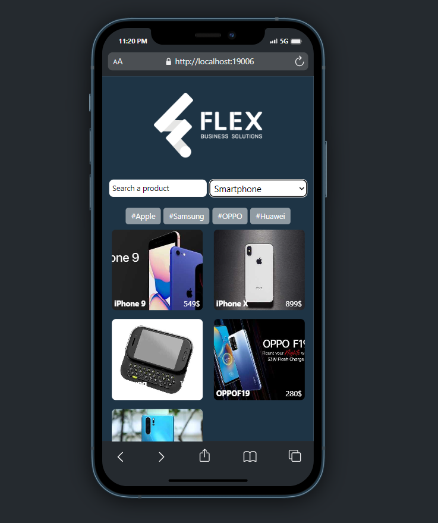

# Shopping-Prod
## Installation

1. Make sure you have Node.js installed on your machine.
2. Clone this repository: https://github.com/EdonaElshani/Shopping-Prod.git
3. Navigate to the project directory:
   #### 1. cd client-app
   #### 2. npm install
   #### 3. npx expo start
   

  

    <h2>Login Screen</h2>
    
  

  

    <h2>Forgot Password</h2>
    
  

    

    <h2>Confirmation Link Screen </h2>
    
  

      

    <h2>Menu </h2>
    
  

